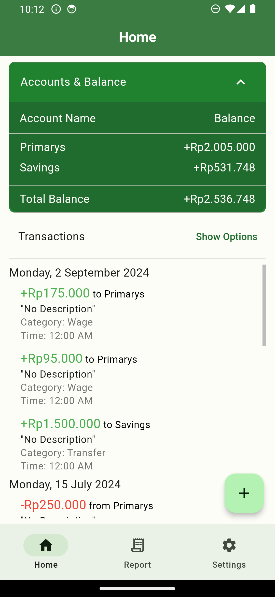
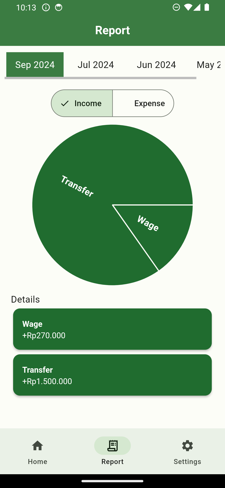
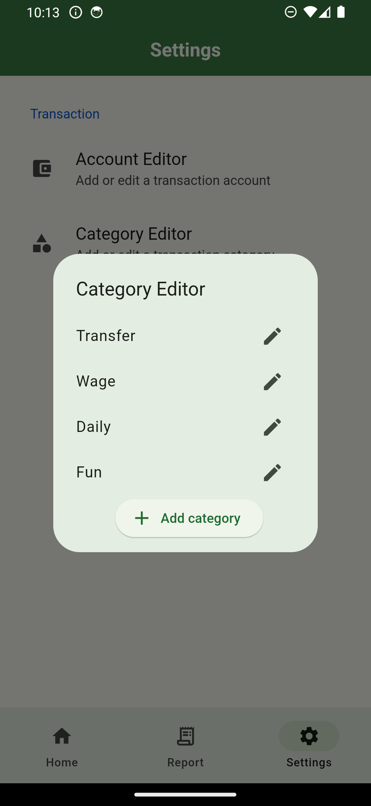

## FinTekk
FinTekk is a daily financial management application, users can see how their income and expenses are every day.

### Flutter Tech Stack
- [Flutter](https://flutter.dev/ "Flutter") 
- [sqflite](https://pub.dev/packages/sqflite) for database
- [Riverpod](https://riverpod.dev/ "Riverpod") for state management

### Project Structure
- **Core**
- **Database**
- **Model**
- **Notifier**
- **Service** (showing up dialog etc. (reduce boilerplate))
- **Presentation**

### Flow
- Widgets/UIs -> Notifier -> Database -> Notifier invalidate itself, state changes -> UI updated
- Widgets/UIs -> Notifier -> another Notifier -> state changes -> UI updated

### Screenshots
<table>
  <tbody>
    <tr>
      <td></td>
      <td></td>
      <td></td>
    </tr>
  </tbody>
</table>